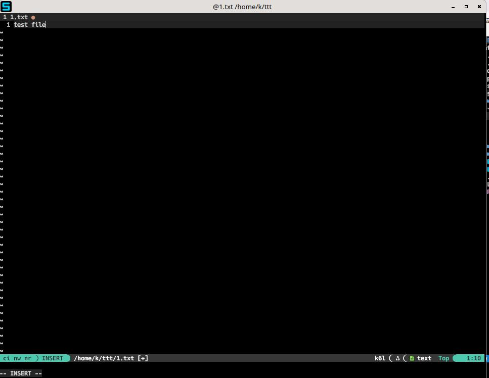
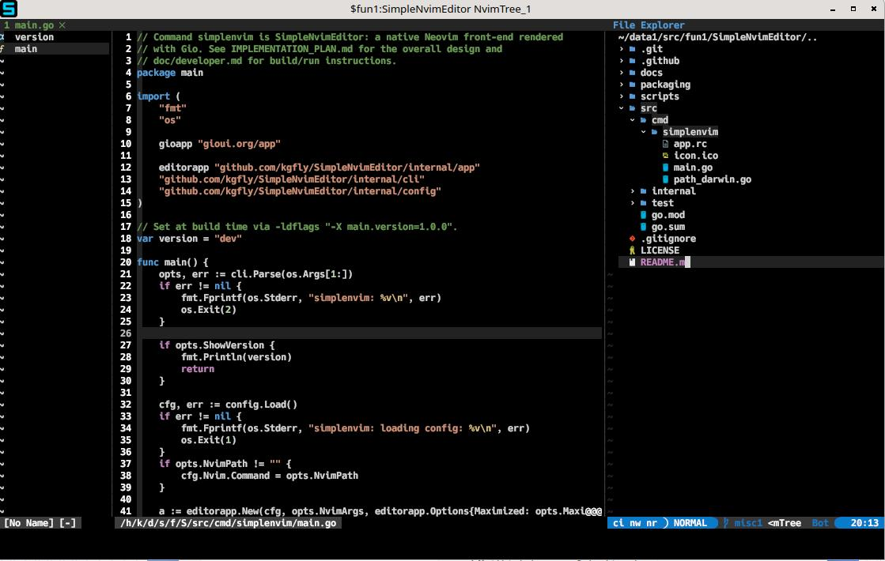
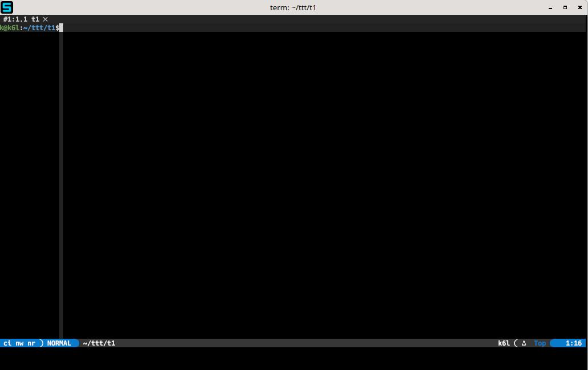
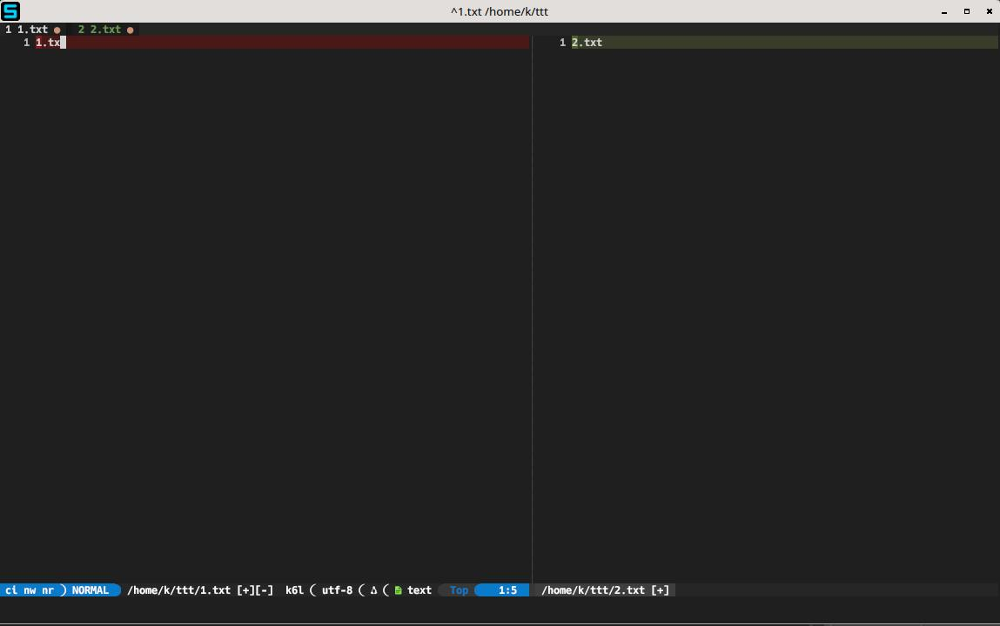

# SimpleNvimEditor

A simple, fast, native Neovim GUI written in [Go](https://go.dev/), using the
[Gio](https://gioui.org) UI toolkit with a minimalist design.

SimpleNvimEditor gives you the Neovim you already know in a lightweight GUI
that works across macOS, Linux, and Windows. It keeps the interface focused on
your editor while adding native windows, GPU rendering, and practical desktop
features.

## What it offers

- **Your Neovim setup.** Runs a real `nvim` process through `nvim_ui_attach`,
  so your configuration, plugins, and workflows come along.
- **Easy-to-find windows.** An innotative, color-grouped, numbered Dock and taskbar icons help
  you pick out the right instance when you have many editors open. See
  [Dock and taskbar icon color](#dock-and-taskbar-icon-color).
- **Native, cross-platform rendering.** Gio draws the window on macOS, Linux,
  and Windows with GPU acceleration and Nerd Font support.
- **Accurate editor layout.** Multigrid rendering places splits and floating
  windows (such as completion popups) where Neovim puts them. Cursor shapes
  update with Neovim's mode.
- **Familiar input.** Keyboard, mouse, scroll wheel, and voice dictation input
  work with Neovim. Drag files into the window to open them, or Cmd-click
  (macOS) or Ctrl-click (Linux and Windows) visible HTTP and HTTPS links to
  open them in your browser.
- **Simple configuration.** An optional `config.toml` lets you choose your font
  and Neovim launch settings.
- **More ways to work.** Run a terminal with
  `simplenvim --maximized -- -c term -c startinsert`, or use Neovim's diff mode
  as a GUI diff tool.

No bundled plugin marketplace or telemetry: just a focused home for Neovim.

## Typical Usage
### Text Editor


### IDE (with LSP On)


### Terminal


### Diff tool

## Installing

Grab a build for your platform from the
[Releases page](https://github.com/kgfly/SimpleNvimEditor/releases).
Nightly pre-releases are built from `main`.

Neovim 0.9+ must be installed and on your `PATH` — this is a GUI *for*
Neovim, not a copy of it.

### Linux: `.deb` / `.rpm`

Install the downloaded package with an explicit path (the leading `./`
matters — without it, apt looks for a *package named* `simplenvim_...`):

```sh
sudo apt install ./simplenvim_<version>_linux_amd64.deb   # Debian/Ubuntu
sudo dnf install ./simplenvim_<version>_linux_amd64.rpm   # Fedora/RHEL
```

If apt prints:

```
Notice: Download is performed unsandboxed as root as file '...' couldn't be
accessed by user '_apt'. - pkgAcquire::Run (13: Permission denied)
```

nothing is wrong with the package. Apt drops privileges to the unprivileged
`_apt` user to copy the file, and that user can't traverse a private home
directory such as a `0700` `~/Downloads`. Apt falls back to running as root
and the install still succeeds — it is a notice, not an error.

To silence it, install from a world-traversable directory instead:

```sh
cp simplenvim_<version>_linux_amd64.deb /tmp/
sudo apt install /tmp/simplenvim_<version>_linux_amd64.deb
```

Prefer this over loosening the permissions on your home directory.

### First launch: unsigned builds

Releases are **not code-signed**, where signing requires a paid Apple developer
account and a paid Windows certificate. All installation packages are built exclusively by the GitHub CI/CD
pipeline.

- **macOS** — right-click the app and choose *Open*, or:
  ```sh
  xattr -c /Applications/SimpleNvimEditor.app
  ```
- **Windows** — on the SmartScreen prompt, click *More info* → *Run anyway*.

Every release does carry
[GitHub build provenance](https://docs.github.com/en/actions/how-tos/secure-your-work/use-artifact-attestations/use-artifact-attestations),
so you can cryptographically confirm a download really was built by this
repo's CI:

```sh
gh attestation verify <downloaded-file> -R kgfly/SimpleNvimEditor
```

## Configuration

SimpleNvimEditor reads an optional TOML configuration file from your OS's
standard config directory. It's entirely optional — sane defaults apply
if it's missing, or if any field is left out:

| OS | Path |
|---|---|
| Linux | `~/.config/simplenvimeditor/config.toml` |
| macOS | `~/Library/Application Support/simplenvimeditor/config.toml` |
| Windows | `%AppData%\simplenvimeditor\config.toml` |

```toml
[editor]
font_size = 14
font_family = "monospace"  # set to your preferred font, e.g. "Hack Nerd Font Mono"
alt_is_meta = true         # send Alt/Option chords to Nvim as <A-...>

[nvim]
command = "nvim"           # path or PATH-resolved name
extra_args = []            # extra args passed straight to nvim
```

You don't need to create this file to get started — the defaults shown
above are exactly what's used if it's absent.

### `alt_is_meta`

This setting is only meaningful on macOS, where Option is a composing key:
Option-a types `å` and Option-Shift-a types `Å`. Keeping the default `true` means those
chords go to Nvim so `<A-a>` and `<A-A>` mappings fire. Set it to `false`
if you would rather type composed characters than use Option as Meta.

On Linux and Windows, Alt is already a pure command modifier and never
produces text, so this setting has no effect there.

## Command-line arguments

Use `--maximized` to start with a maximized window, or `--nvim <path>` to use
a specific Neovim executable. `--version` (or `-v`) prints the version and
exits. File arguments are forwarded to Neovim. Put
`--` before Neovim flags or commands so SimpleNvimEditor does not interpret
them as its own options:

```sh
simplenvim --maximized -- -c term -c 'edit ~/todo.txt'
```

## Dock and taskbar icon color

Q: when you have 3 instances running as text editor, 3 instances running as IDE,  3 instances running as diff tool,  3 instances running as terminal, 
how do you find which is for what?

A: the dock or taskbar icon color tells them
apart. The "S" stays the same and only the background changes:

- **Black** is the default.
- **Any other color** can be chosen by setting `SIMPLENVIM_BG_<COLOR>` before
  the app starts. The value doesn't matter and the name is case-insensitive:

  ```sh
  SIMPLENVIM_BG_RED=1 simplenvim ~/test.txt
  ```

  The available colors are `BLUE`, `GREEN`, `YELLOW`, `RED`, `ORANGE`,
  `PURPLE`, `PINK`, `BROWN`, `BLACK`, `WHITE` and `GRAY`.

Editors with the same color are also numbered: the first shows the plain
icon, the 2nd to 9th show a big "2" to "9" with a small "s" in the corner
instead of the "S", and the 10th and
later show the plain icon again. A new editor takes the lowest free number,
and a number is freed as soon as its editor exits, even if it is killed.

Editors started without `SIMPLENVIM_BG_*` use the default black icon and are
not numbered. To number them too, set `SIMPLENVIM_BG_DEFAULT`, which (like
`SIMPLENVIM_BG_BLACK`) joins the numbered black group:

```sh
SIMPLENVIM_BG_DEFAULT=1 simplenvim ~/test.txt
```

Platform notes:

- **macOS:** the Dock icon changes while the app runs. A pinned Dock tile
  shows the default icon when the app isn't running.
- **Windows:** each color and number gets its own taskbar group.
- **Linux:** icons other than plain black need the icons and hidden `.desktop`
  entries installed by the `.deb`, `.rpm` or Arch package, because docks and
  panels look them up by app ID (`simplenvim-<color>[-<number>]`). On X11 the
  window icon itself also changes, so window-icon taskbars such as
  xfce4-panel and IceWM show it even without the package. On FreeBSD and
  OpenBSD editors aren't numbered.

## Versioning Rule
For v"X.Y.Z":

Z: bug fix. And Z does not bump Y.

Y: normal feature update.

X: major feature update else it gets bumped every 10 Y.

## Reporting issues

If an issue of yours was closed but the problem isn't actually fixed, comment
`/reopen` on it. A bot reopens it automatically: no write access is needed, and
you don't have to wait for a maintainer.

This only works on issues **you** opened, and `/reopen` must start the comment.

## Developer Documentation

- [`docs/developer.md`](docs/developer.md) — everything about building,
  running, testing, and contributing.

## License

MIT — see [LICENSE](LICENSE).
